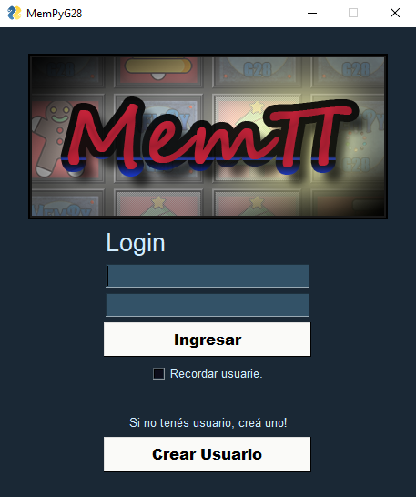

# Bienvenide a MemPy Grupo28!

## Instrucciones de uso: 
1) Para ejecutar la aplicación necesitás tener instalado Python 3.0 en adelante: 
    + *[Descargar Python](https://www.python.org/downloads/)*   

2) Una vez instalado, debemos abrir una Terminal del Sistema Operativo en uso, e instalar PySimpleGUI, ingresando la siguiente linea: 
    + *py install PySimpleGUI*   

3) Acto seguido, de manera similar, instalamos Pandas, con la siguiente linea: 
    + *pip install pandas*   
	
4) Finalmente, desde la misma terminal, nos posicionamos en la carpeta donde tenemos el juego. 
Esto podemos hacerlo de manera rapida: 
    a. elegir la partición donde tenemos el juego (por ej. 'E') con la siguiente linea: 
    + *E:*  

    b. Y luego copiar la direccion entera, desde el explorador de directorios, de la carpeta del juego (trabajo) y pegarla en la termina, antecedida de "cd ". Ej.: 
    + *cd E:\Python\Grupo28\\*   

5) Ejecutamos el archivo 'mempy.py' con la siguiente linea: 
    + *python mempy.py*   

6) De ejecutarse bien, deberías ver una pantalla como la siguiente:  
   

## NOTA: 
 &ensp;&ensp;Si llegara a haber algún problema, se encuntra adjunto un archivo de especificaciones llamado *"requirements.txt"* en donde podés encontrar las versiones de todas las librerías que usa MempyG28. 
 &ensp;&ensp;Para instalarlas y asegurarte de que ande todo como debe, podés hacerlo con el siguiente comando: 
+ *pip install -r requirements.txt* 

---

## Posibles errores: 
1) Si al entrar a una partida y presionar el botón de 'Comenzar', el juego se cierra, asegurate de tener la versión especificada de PySimpleGUI.   

**Gracias, y que te diviertas!**  

### *-[Lore, Nacho, Maxi]-* 
### &ensp;&ensp;&ensp;&ensp;&ensp; -[2021]-

*Juego creado en grupo para la cátedra de Python, Universidad Nacional de La Plata.-*
